Controlled recombination simulation, biparental model analysis, cycle 10
================

### Notes:

Each simulation rep draws from P1xP2 (“PI\_220431” and “PI\_185715”,
selected from 26 founders for least genetic map lost when filtering for
polymorphisms and greatest SNP density)

Breeding scheme: P1xP2 -&gt; 400 F1s -&gt; 400 DHs, phenotype, serves as
TP and GS cycle 1 starting pop, variance standardized to 1 -&gt; change
recombination distribution (WT, 20X Peri or 20X Chr) –&gt; 400 F1s -&gt;
400 DHs, train model, phenotype and update TP with top 160 (40%) DHs and
drop bottom 80 (20%), advance top 20 DHs (5% selection intensity) for
next cycle of 400 new F1s, repeat for 10 cycles

**WT map type does not get a recombination change, WT is always WT while
Peri and Chr are always 2 or 20X**

<details>
<summary>
Click here: simulation parameters
</summary>

#### Variables:

**Recombination:** WT, 2X or 20X  
**Genetic map change:** WT, Pericentromere or Chromosome  
**Repulsion:** 3:4 **Heritability:** 0.2 or 0.8  
**QTL per Chr:** 2 or 200  
**Relationship matrix:** genomewide or causal variant

#### Load packages and data

``` r
library(tidyverse)
library(data.table)
library(kableExtra)
library(ggsci)
library(gt)
library(lme4)
library(emmeans)
library(car)
library(broom.mixed)


gg <- fread("https://raw.githubusercontent.com/etaagen/dissertation_chapter_4/main/Supplementary_2/results_S2.1/bp_gg.csv") %>% as.data.frame()
gv <- fread("https://raw.githubusercontent.com/etaagen/dissertation_chapter_4/main/Supplementary_2/results_S2.1/bp_gv.csv") %>% as.data.frame()
pa <- fread("https://raw.githubusercontent.com/etaagen/dissertation_chapter_4/main/Supplementary_2/results_S2.1/bp_pa.csv") %>% as.data.frame()
be <- fread("https://raw.githubusercontent.com/etaagen/dissertation_chapter_4/main/Supplementary_2/results_S2.1/bp_be.csv") %>% as.data.frame()
# be `value` is 2-fold higher than it should be (ASR does not know how to treat VarA/GenicVarA for DH)
be$value <- be$value/2
qtl <- fread("https://raw.githubusercontent.com/etaagen/dissertation_chapter_4/main/Supplementary_2/results_S2.1/bp_qtl.csv") %>% as.data.frame()
qtl_af <- fread("https://raw.githubusercontent.com/etaagen/dissertation_chapter_4/main/Supplementary_2/results_S2.1/bp_qtl_af.csv") %>% as.data.frame()
```

**Data frames**

gg: population’s genetic gain  
gv: additive genetic variance of population  
pa: prediction accuracy of genomic selection  
be: Bulmer effect (varA/genicVarA)  
qtl: positive and negative effect QTL fixation ratio  
qtl\_af: change in QTL negative allele frequency, subset by small (Q1),
medium, or large (Q3) effect size

**Columns**

**rep** is 1:number of reps simulation was run  
**cycle** designates founder / burnin (0), and GS cycle 1:10  
**value** is the raw response variable measurement, (or average after
summary function, grouped by legend and cycle, of all rep)  
**Matrix** is the relationship matrix used in RRBLUP, genomewide or
causal variant  
**Pop** is the full founder set (F) or biparental (bp)  
**Recombination** is the scale of map change, 2 or 20X  
**H2** is the broad sense heritability  
**QTL** is the number of QTL per chromosome  
**Map\_Type** is the WT, Pericentromere, or Chromosome-wide change to
the genetic map, given a Recombination scale  
**Repulsion** is 1:5 representing different coupling and replusion
ratios

-   3: Random 1/2 of additive effect signs are positive and 1/2 are
    negative for QTL

-   4: 1/2 of additive effect signs are positive and 1/2 are negative
    for QTL, alternating positive or negative each QTL

</details>

### Genetic gain

**Linear model, ANOVA table, best and worst simulation parameters by
genetic map**

<details>
<summary>
Click here: Model, ANOVA tables cycle 10
</summary>

**Note:** filtered for cycle 6 or cycle 10 observations. See .Rmd file
for code.

`response variable ~ (map type + recombination + QTL per Chr + H2 + repulsion + matrix )^2 + (1|rep)`

ANOVA table, cycle 10:

    ## Analysis of Deviance Table (Type II Wald chisquare tests)
    ## 
    ## Response: value
    ##                              Chisq Df Pr(>Chisq)    
    ## Map_type                   90.4656  2  < 2.2e-16 ***
    ## Recombination              30.0681  1  4.171e-08 ***
    ## QTL                     16679.3681  1  < 2.2e-16 ***
    ## H2                      20842.2336  1  < 2.2e-16 ***
    ## Repulsion                 354.4075  1  < 2.2e-16 ***
    ## Matrix                    426.0064  1  < 2.2e-16 ***
    ## Map_type:Recombination     10.3074  2   0.005778 ** 
    ## Map_type:QTL               64.0484  2  1.236e-14 ***
    ## Map_type:H2               102.5087  2  < 2.2e-16 ***
    ## Map_type:Repulsion         18.9383  2  7.720e-05 ***
    ## Map_type:Matrix            19.0547  2  7.283e-05 ***
    ## Recombination:QTL          20.2427  1  6.821e-06 ***
    ## Recombination:H2           55.2545  1  1.059e-13 ***
    ## Recombination:Repulsion     2.1070  1   0.146625    
    ## Recombination:Matrix       38.4279  1  5.681e-10 ***
    ## QTL:H2                   6427.6264  1  < 2.2e-16 ***
    ## QTL:Repulsion             131.3926  1  < 2.2e-16 ***
    ## QTL:Matrix                  1.0763  1   0.299533    
    ## H2:Repulsion               57.5743  1  3.255e-14 ***
    ## H2:Matrix                  40.6544  1  1.817e-10 ***
    ## Repulsion:Matrix           68.2795  1  < 2.2e-16 ***
    ## ---
    ## Signif. codes:  0 '***' 0.001 '**' 0.01 '*' 0.05 '.' 0.1 ' ' 1

</details>
<details>
<summary>
Click here: Cycle 10, best and worst simulation parameter prediction
summaries
</summary>

#### Cycle 10, WT map

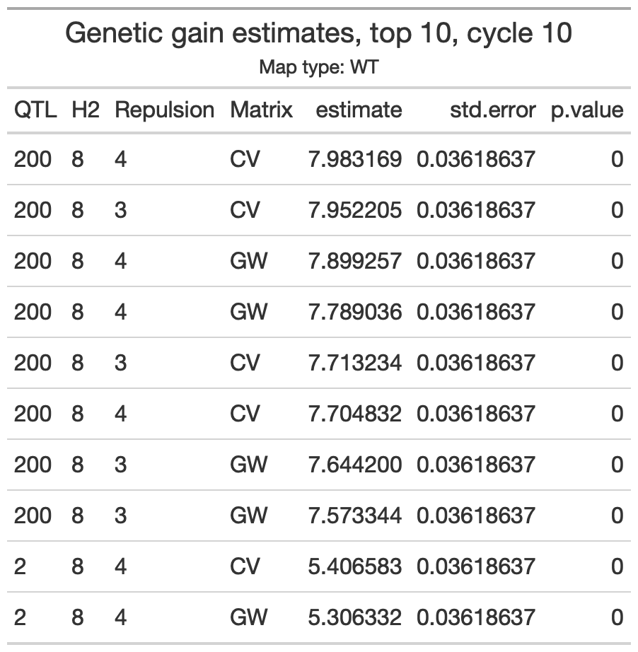<!-- -->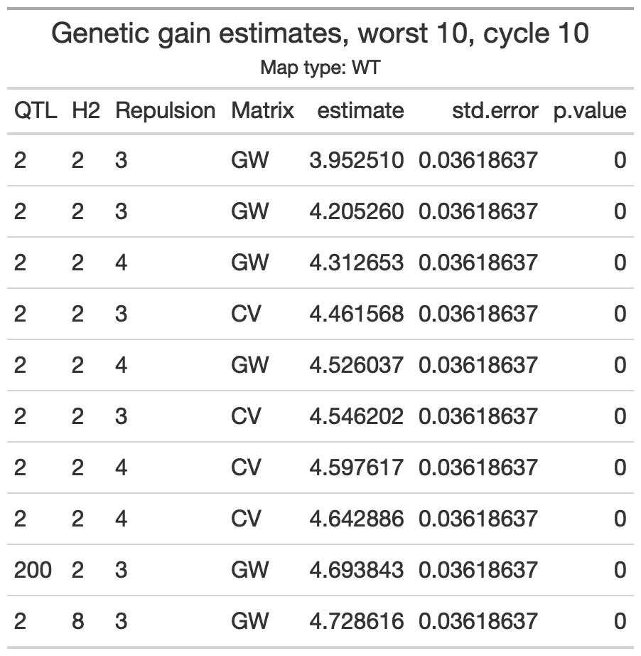<!-- -->

#### Cycle 10, Pericentromere map

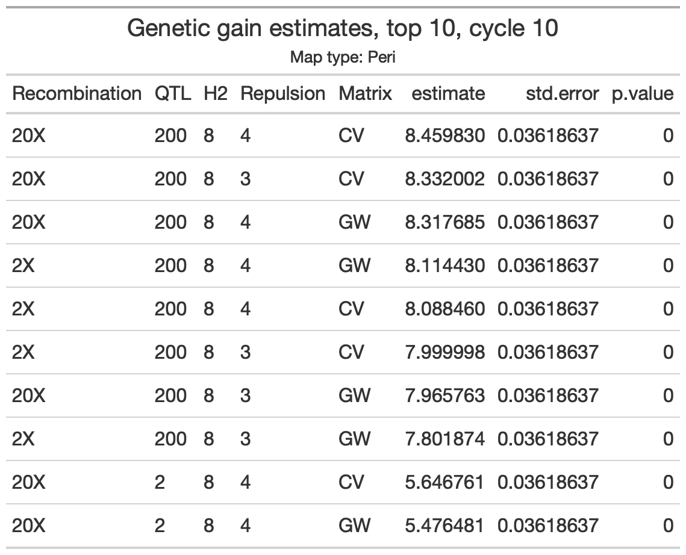<!-- -->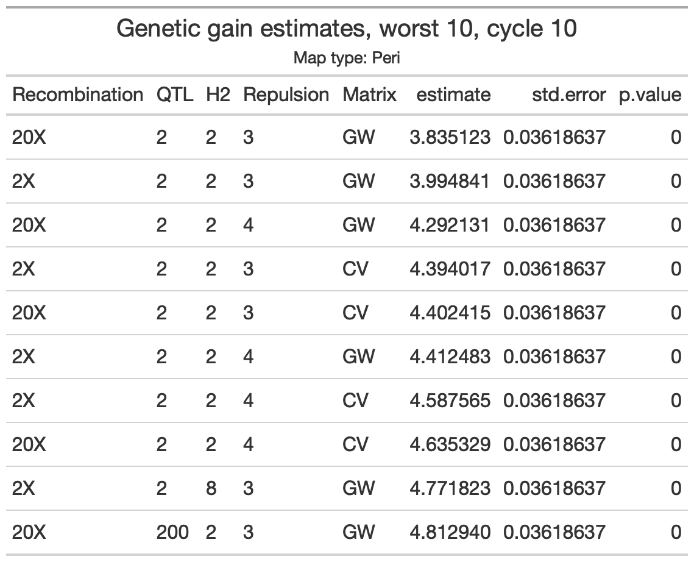<!-- -->

#### Cycle 10, Chromosome map

<!-- -->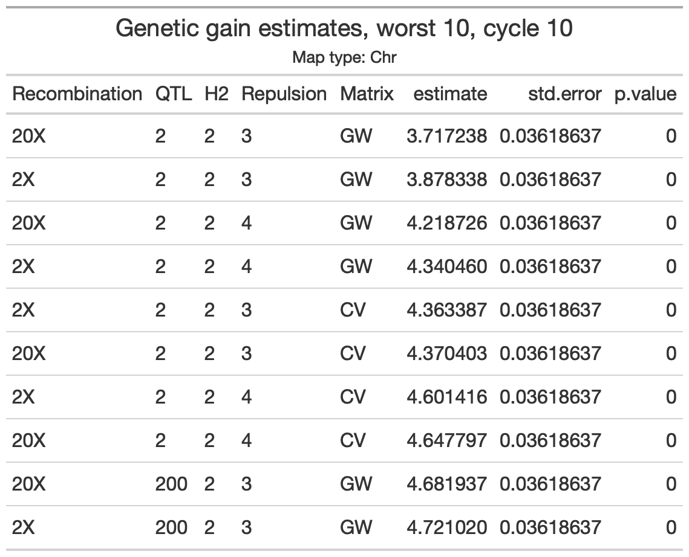<!-- -->

</details>

### Genetic variance

**Linear model, ANOVA table, best and worst simulation parameters by
genetic map**

<details>
<summary>
Click here: Model, ANOVA tables cycle 10
</summary>

**Note:** filtered for cycle 6 or cycle 10 observations. See .Rmd file
for code.

`response variable ~ (map type + recombination + QTL per Chr + H2 + repulsion + matrix )^2 + (1|rep)`

ANOVA table, cycle 10:

    ## Analysis of Deviance Table (Type II Wald chisquare tests)
    ## 
    ## Response: value
    ##                             Chisq Df Pr(>Chisq)    
    ## Map_type                 976.9887  2  < 2.2e-16 ***
    ## Recombination            366.3512  1  < 2.2e-16 ***
    ## QTL                     8976.5948  1  < 2.2e-16 ***
    ## H2                      1836.9323  1  < 2.2e-16 ***
    ## Repulsion                 97.9377  1  < 2.2e-16 ***
    ## Matrix                   688.3416  1  < 2.2e-16 ***
    ## Map_type:Recombination   293.9275  2  < 2.2e-16 ***
    ## Map_type:QTL             485.1675  2  < 2.2e-16 ***
    ## Map_type:H2               57.6503  2  3.030e-13 ***
    ## Map_type:Repulsion        17.5359  2  0.0001556 ***
    ## Map_type:Matrix           21.8141  2  1.833e-05 ***
    ## Recombination:QTL        196.3704  1  < 2.2e-16 ***
    ## Recombination:H2           5.5333  1  0.0186584 *  
    ## Recombination:Repulsion    0.1950  1  0.6587502    
    ## Recombination:Matrix       0.3303  1  0.5655003    
    ## QTL:H2                   171.8669  1  < 2.2e-16 ***
    ## QTL:Repulsion              5.7729  1  0.0162755 *  
    ## QTL:Matrix               199.4318  1  < 2.2e-16 ***
    ## H2:Repulsion              10.6716  1  0.0010879 ** 
    ## H2:Matrix                275.4566  1  < 2.2e-16 ***
    ## Repulsion:Matrix           1.2828  1  0.2573839    
    ## ---
    ## Signif. codes:  0 '***' 0.001 '**' 0.01 '*' 0.05 '.' 0.1 ' ' 1

</details>
<details>
<summary>
Click here: Cycle 10, best and worst simulation parameter prediction
summaries
</summary>

#### Cycle 10, WT map

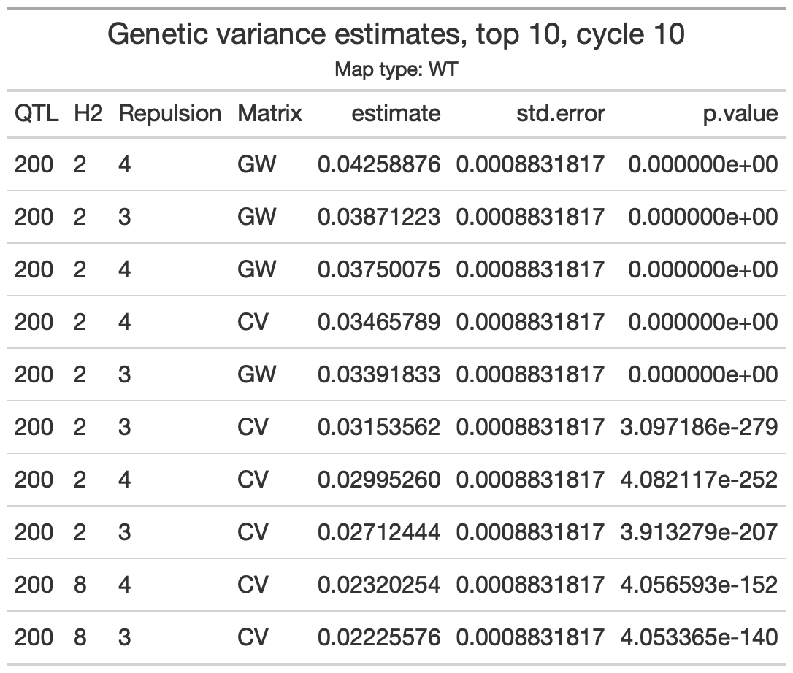<!-- -->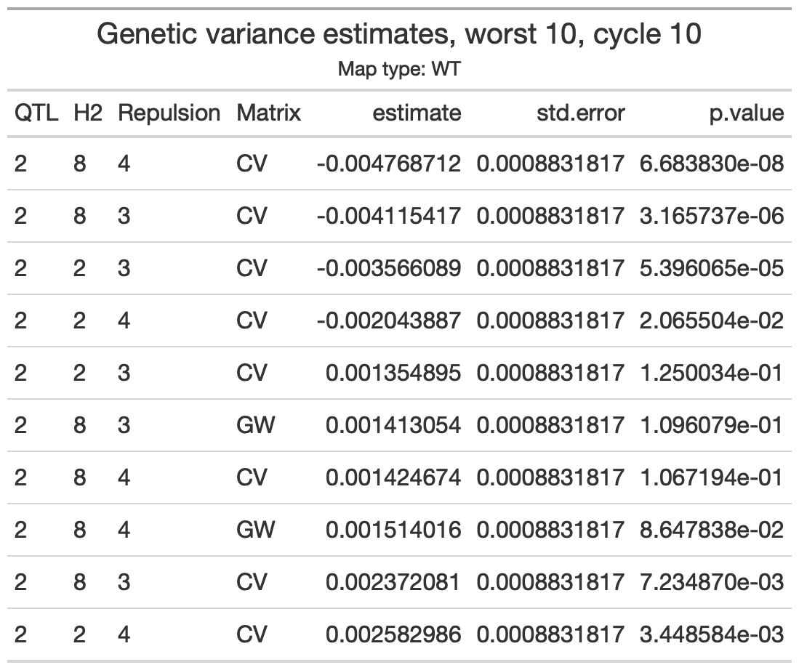<!-- -->

#### Cycle 10, Pericentromere map

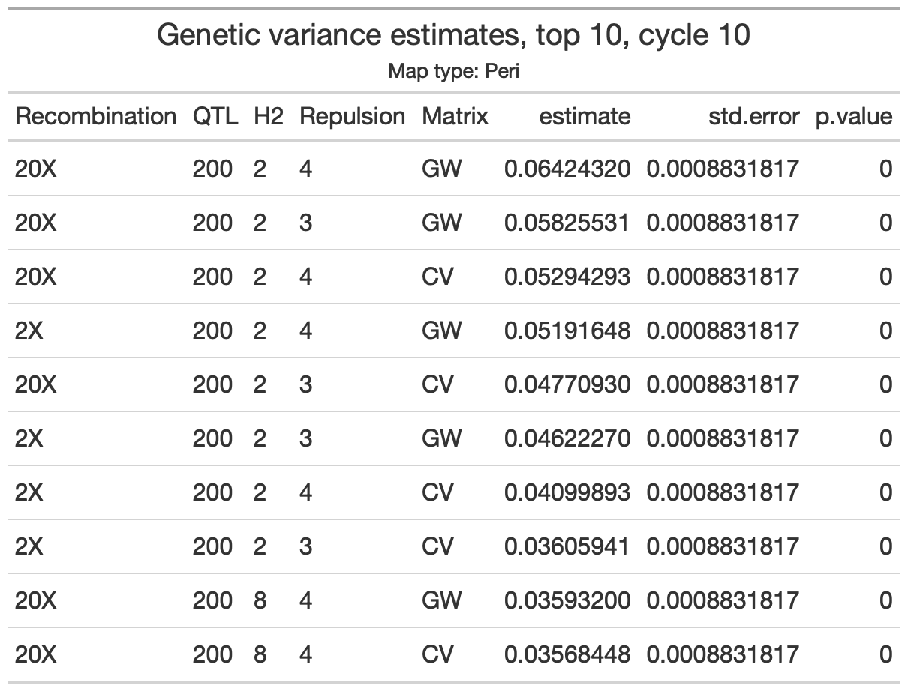<!-- -->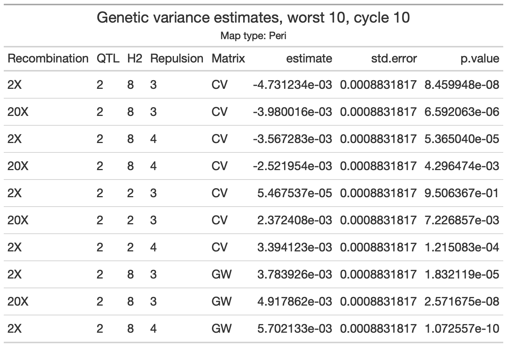<!-- -->

#### Cycle 10, Chromosome map

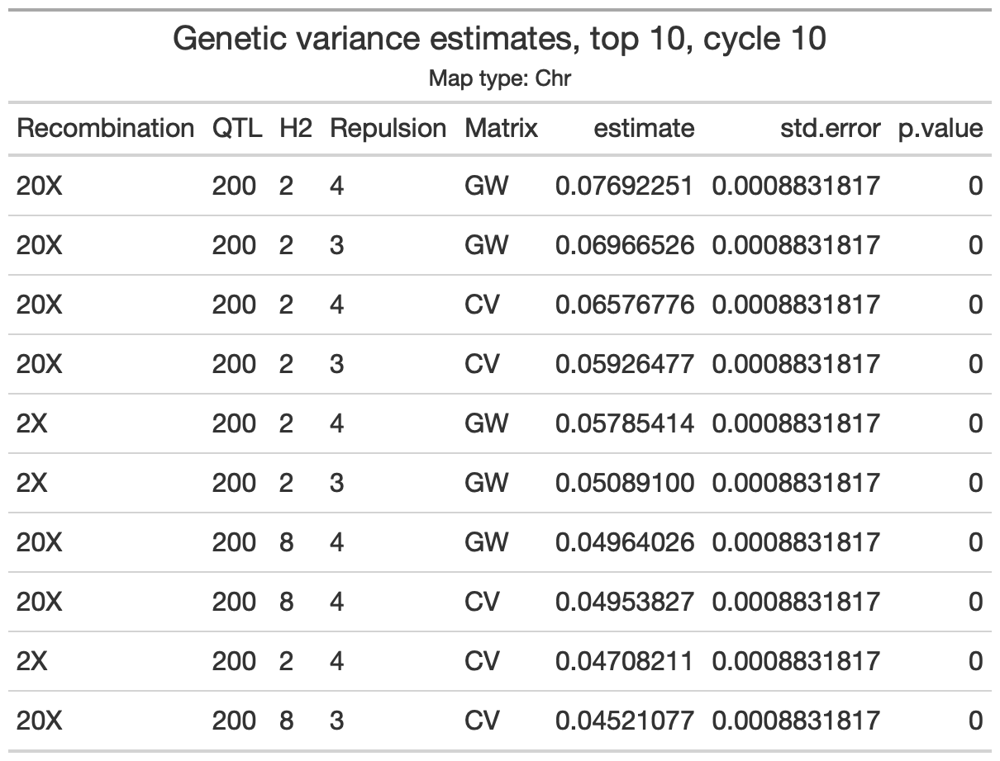<!-- -->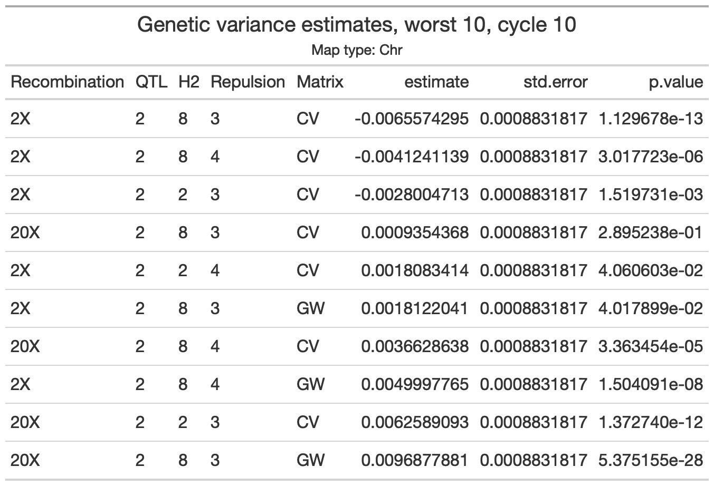<!-- -->

</details>

### Bulmer effect

**Linear model, ANOVA table, best and worst simulation parameters by
genetic map**

<details>
<summary>
Click here: Model, ANOVA tables cycle 10
</summary>

**Note:** filtered for cycle 6 or cycle 10 observations. See .Rmd file
for code.

`response variable ~ (map type + recombination + QTL per Chr + H2 + repulsion + matrix )^2 + (1|rep)`

ANOVA table, cycle 10:

    ## Analysis of Deviance Table (Type II Wald chisquare tests)
    ## 
    ## Response: value
    ##                             Chisq Df Pr(>Chisq)    
    ## Map_type                 170.0048  2  < 2.2e-16 ***
    ## Recombination             53.7328  1  2.297e-13 ***
    ## QTL                     5332.8285  1  < 2.2e-16 ***
    ## H2                      1655.4458  1  < 2.2e-16 ***
    ## Repulsion               2921.8247  1  < 2.2e-16 ***
    ## Matrix                     2.4484  1    0.11765    
    ## Map_type:Recombination    54.9789  2  1.152e-12 ***
    ## Map_type:QTL               1.3626  2    0.50595    
    ## Map_type:H2                1.4549  2    0.48315    
    ## Map_type:Repulsion         3.8691  2    0.14449    
    ## Map_type:Matrix            1.0137  2    0.60240    
    ## Recombination:QTL          3.7613  1    0.05245 .  
    ## Recombination:H2           0.0017  1    0.96752    
    ## Recombination:Repulsion    0.9460  1    0.33075    
    ## Recombination:Matrix       0.3961  1    0.52909    
    ## QTL:H2                   140.0076  1  < 2.2e-16 ***
    ## QTL:Repulsion            489.3870  1  < 2.2e-16 ***
    ## QTL:Matrix                 2.6291  1    0.10492    
    ## H2:Repulsion             165.8936  1  < 2.2e-16 ***
    ## H2:Matrix                 15.7258  1  7.322e-05 ***
    ## Repulsion:Matrix           3.0878  1    0.07888 .  
    ## ---
    ## Signif. codes:  0 '***' 0.001 '**' 0.01 '*' 0.05 '.' 0.1 ' ' 1

</details>
<details>
<summary>
Click here: Cycle 10, best and worst simulation parameter prediction
summaries
</summary>

#### Cycle 10, WT map

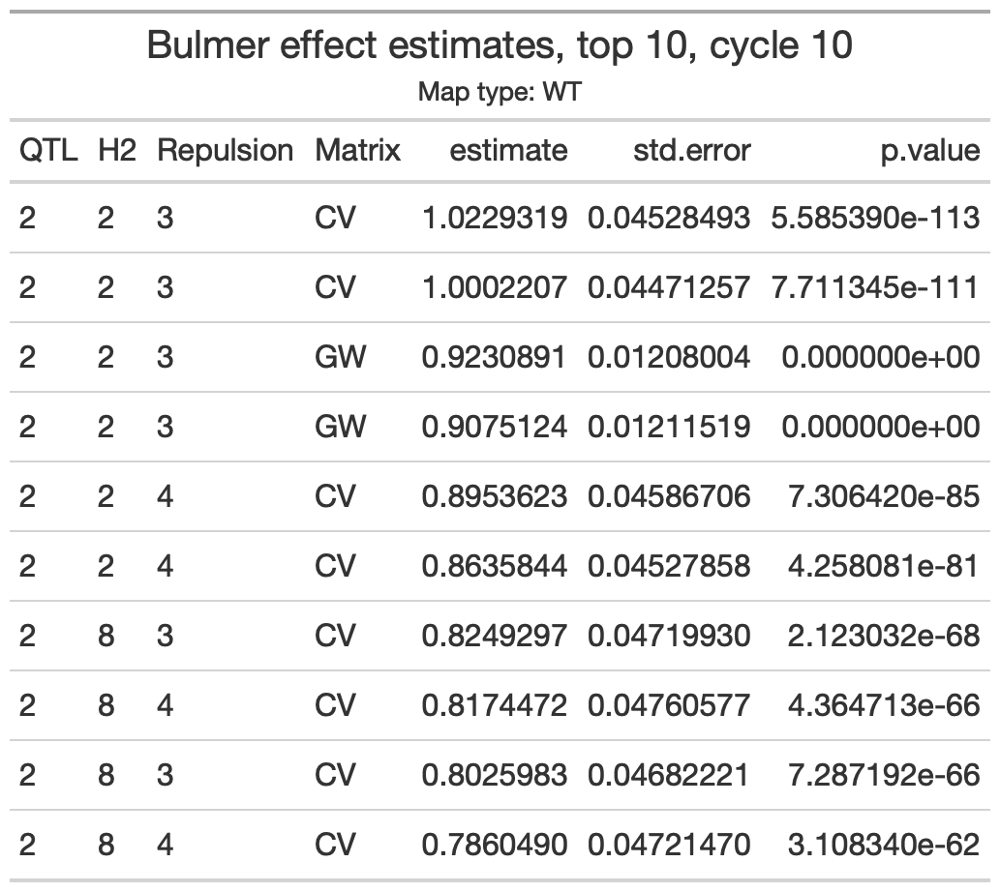<!-- --><!-- -->

#### Cycle 10, Pericentromere map

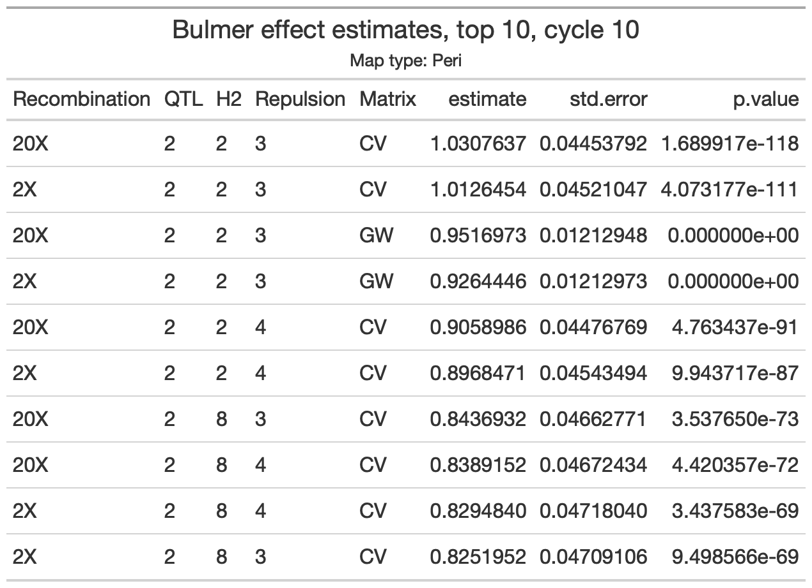<!-- -->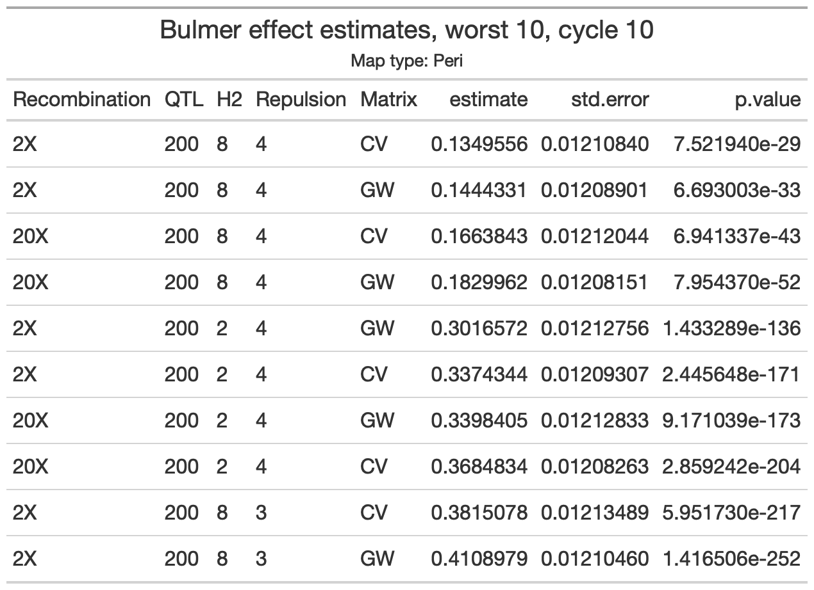<!-- -->

#### Cycle 10, Chromosome map

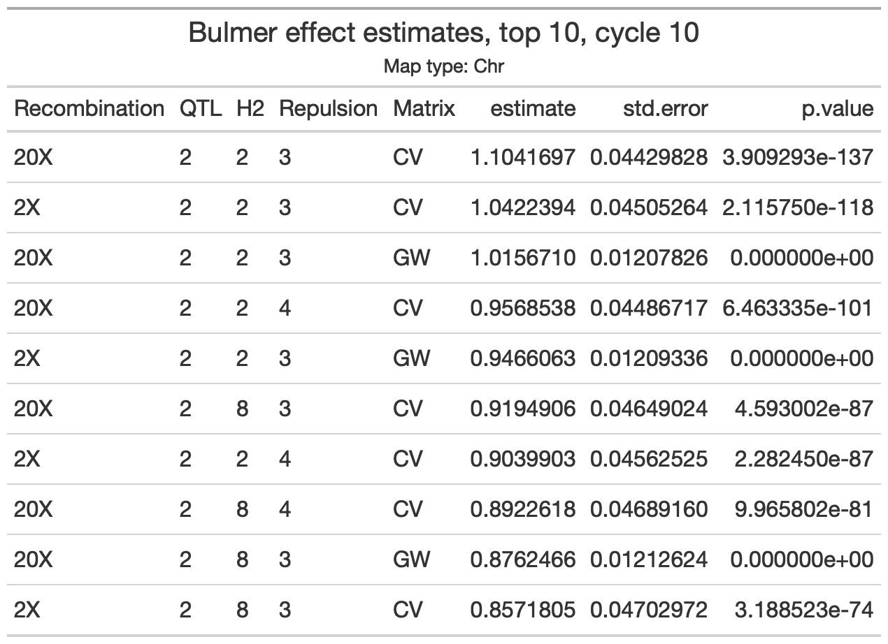<!-- --><!-- -->

</details>

### Prediction accuracy

**Linear model, ANOVA table, best and worst simulation parameters by
genetic map**

<details>
<summary>
Click here: Model, ANOVA tables cycle 10
</summary>

**Note:** filtered for cycle 6 or cycle 10 observations. See .Rmd file
for code.

`response variable ~ (map type + recombination + QTL per Chr + H2 + repulsion + matrix )^2 + (1|rep)`

    ## boundary (singular) fit: see help('isSingular')

ANOVA table, cycle 10:

    ## Analysis of Deviance Table (Type II Wald chisquare tests)
    ## 
    ## Response: value
    ##                             Chisq Df Pr(>Chisq)    
    ## Map_type                   6.8729  2  0.0321784 *  
    ## Recombination              0.4077  1  0.5231427    
    ## QTL                     3469.6834  1  < 2.2e-16 ***
    ## H2                      6358.1549  1  < 2.2e-16 ***
    ## Repulsion                 15.1990  1  9.675e-05 ***
    ## Matrix                    31.7715  1  1.734e-08 ***
    ## Map_type:Recombination     5.2613  2  0.0720305 .  
    ## Map_type:QTL              22.4868  2  1.309e-05 ***
    ## Map_type:H2                0.5673  2  0.7530181    
    ## Map_type:Repulsion         1.6146  2  0.4460616    
    ## Map_type:Matrix           26.5695  2  1.700e-06 ***
    ## Recombination:QTL          1.3946  1  0.2376259    
    ## Recombination:H2           1.4209  1  0.2332475    
    ## Recombination:Repulsion    0.0068  1  0.9343151    
    ## Recombination:Matrix       0.0005  1  0.9818378    
    ## QTL:H2                  1320.1832  1  < 2.2e-16 ***
    ## QTL:Repulsion             11.9847  1  0.0005364 ***
    ## QTL:Matrix                 2.1842  1  0.1394318    
    ## H2:Repulsion               0.0013  1  0.9708198    
    ## H2:Matrix                  6.0854  1  0.0136307 *  
    ## Repulsion:Matrix           2.1714  1  0.1406024    
    ## ---
    ## Signif. codes:  0 '***' 0.001 '**' 0.01 '*' 0.05 '.' 0.1 ' ' 1

</details>
<details>
<summary>
Click here: Cycle 10, best and worst simulation parameter prediction
summaries
</summary>

#### Cycle 10, WT map

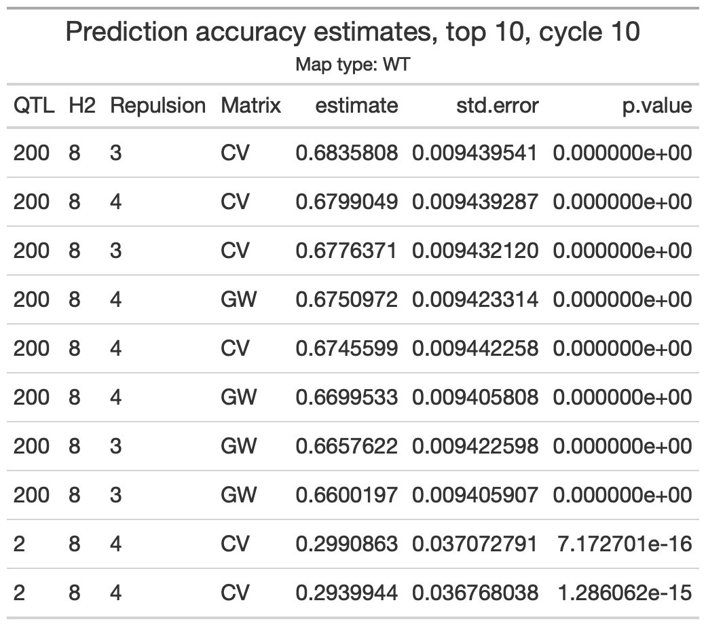<!-- -->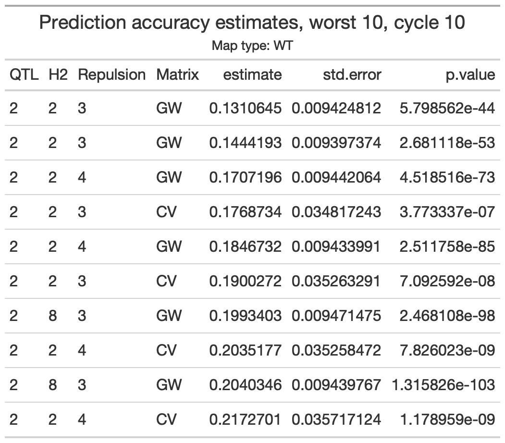<!-- -->

#### Cycle 10, Pericentromere map

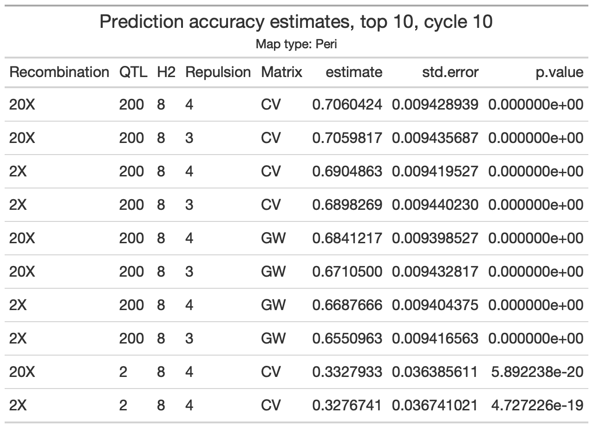<!-- -->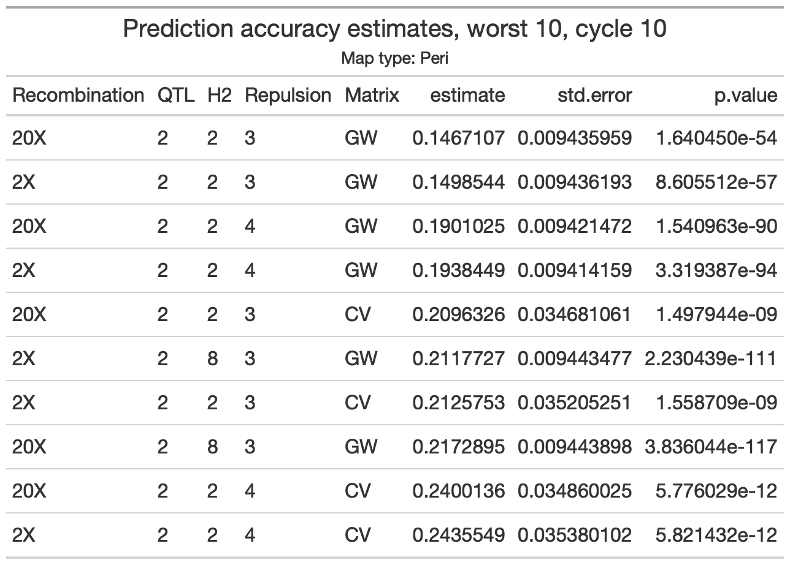<!-- -->

#### Cycle 10, Chromosome map

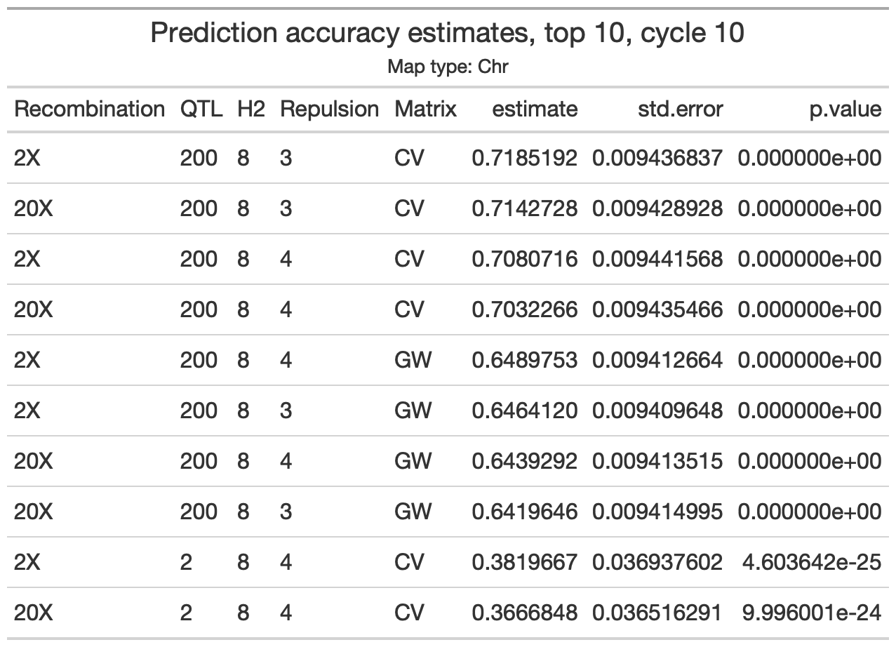<!-- -->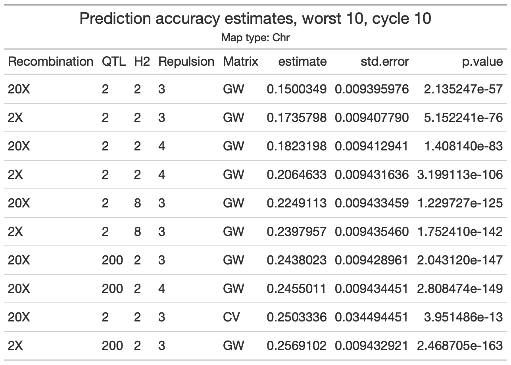<!-- -->

</details>

### QTL fixation

**Linear model has `singular fit`, omitted**

### QTL positive allele frequency change

**Linear model, ANOVA table, best and worst simulation parameters by
genetic map**

<details>
<summary>
Click here: Model, ANOVA table
</summary>

**Note:** total cycle change observations. See .Rmd file for code.

`response variable ~ (map type + recombination + QTL per Chr + H2 + repulsion + matrix + allele)^2 + (1|rep)`

ANOVA table:

    ## Analysis of Deviance Table (Type II Wald chisquare tests)
    ## 
    ## Response: value
    ##                              Chisq Df Pr(>Chisq)    
    ## Map_type                9.1669e+00  2  0.0102195 *  
    ## Recombination           8.4620e-01  1  0.3576331    
    ## QTL                     1.3679e+05  1  < 2.2e-16 ***
    ## H2                      5.4466e+03  1  < 2.2e-16 ***
    ## Repulsion               2.1079e+03  1  < 2.2e-16 ***
    ## Matrix                  3.2319e+03  1  < 2.2e-16 ***
    ## Allele                  4.6420e+04  2  < 2.2e-16 ***
    ## Map_type:Recombination  7.1000e-03  2  0.9964539    
    ## Map_type:QTL            3.0601e+00  2  0.2165210    
    ## Map_type:H2             9.6276e+00  2  0.0081169 ** 
    ## Map_type:Repulsion      2.0892e+01  2  2.907e-05 ***
    ## Map_type:Matrix         5.8024e+00  2  0.0549581 .  
    ## Map_type:Allele         5.8816e+00  4  0.2081682    
    ## Recombination:QTL       2.8500e-02  1  0.8658609    
    ## Recombination:H2        1.0000e-04  1  0.9928810    
    ## Recombination:Repulsion 5.0876e+00  1  0.0240979 *  
    ## Recombination:Matrix    9.8014e+00  1  0.0017437 ** 
    ## Recombination:Allele    4.7340e+00  2  0.0937600 .  
    ## QTL:H2                  3.5671e+03  1  < 2.2e-16 ***
    ## QTL:Repulsion           7.5600e-02  1  0.7833993    
    ## QTL:Matrix              3.1310e+03  1  < 2.2e-16 ***
    ## QTL:Allele              1.4792e+04  2  < 2.2e-16 ***
    ## H2:Repulsion            8.8426e+00  1  0.0029427 ** 
    ## H2:Matrix               1.2605e+01  1  0.0003846 ***
    ## H2:Allele               6.4655e+02  2  < 2.2e-16 ***
    ## Repulsion:Matrix        2.9290e+02  1  < 2.2e-16 ***
    ## Repulsion:Allele        7.8737e+02  2  < 2.2e-16 ***
    ## Matrix:Allele           7.5260e+02  2  < 2.2e-16 ***
    ## ---
    ## Signif. codes:  0 '***' 0.001 '**' 0.01 '*' 0.05 '.' 0.1 ' ' 1

</details>
<details>
<summary>
Click here: Best and worst simulation parameter prediction summaries
</summary>

#### WT map

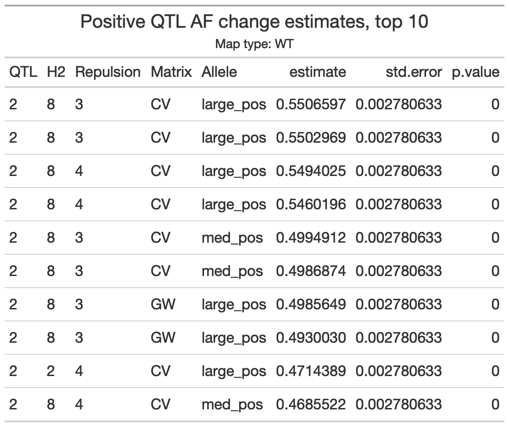<!-- -->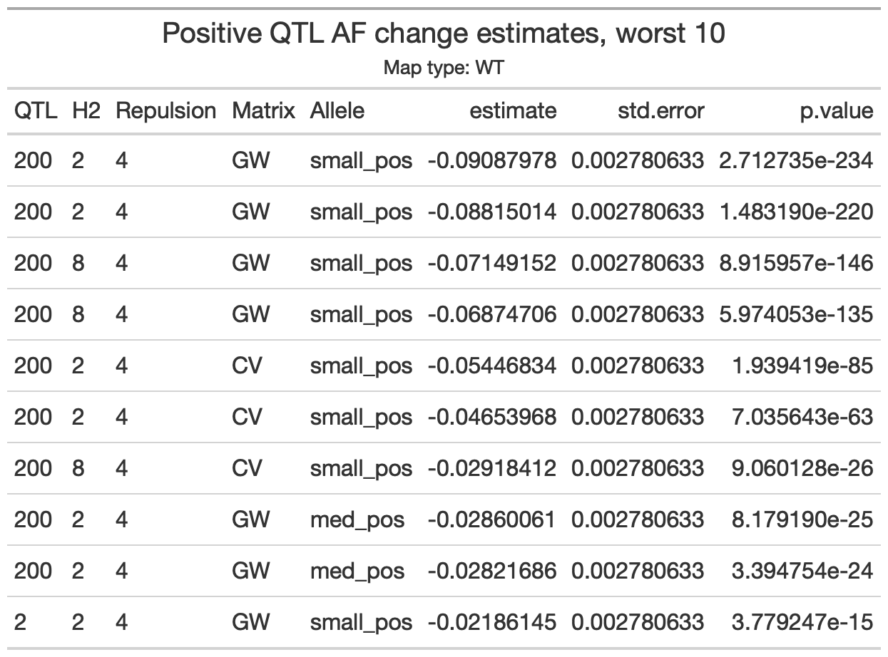<!-- -->

#### Pericentromere map

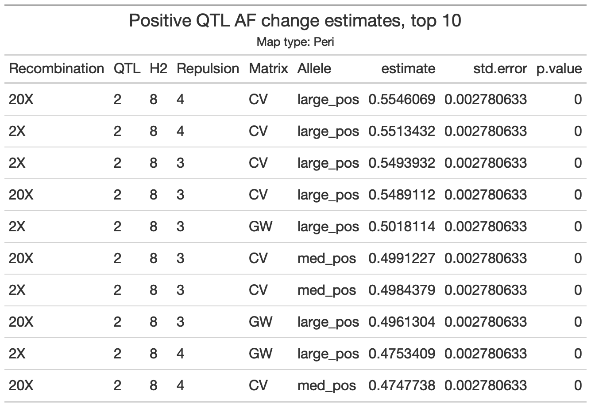<!-- -->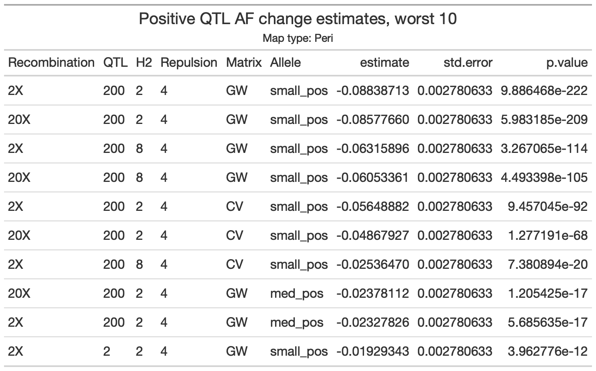<!-- -->

#### Chromosome map

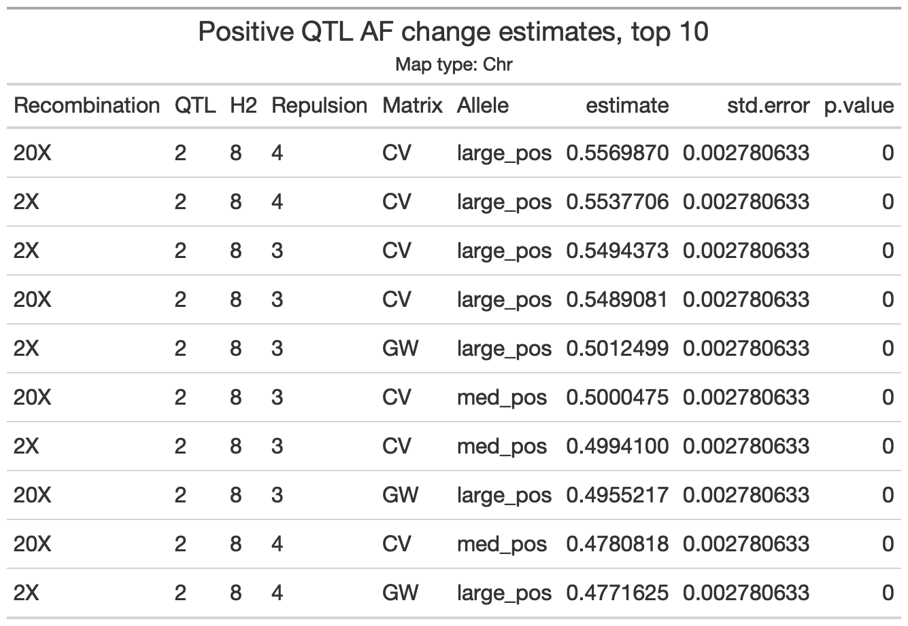<!-- -->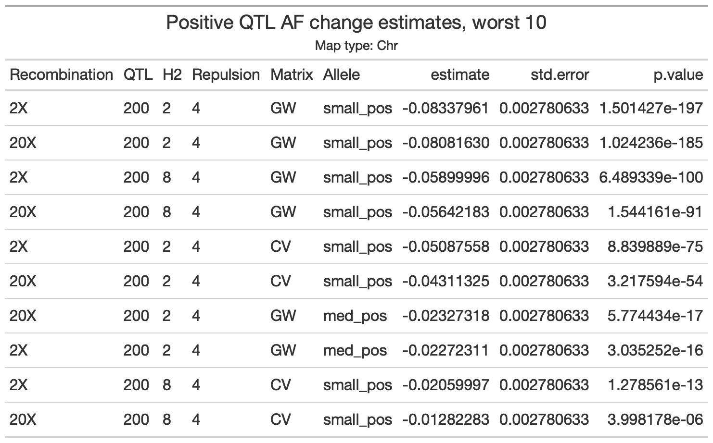<!-- -->

</details>
